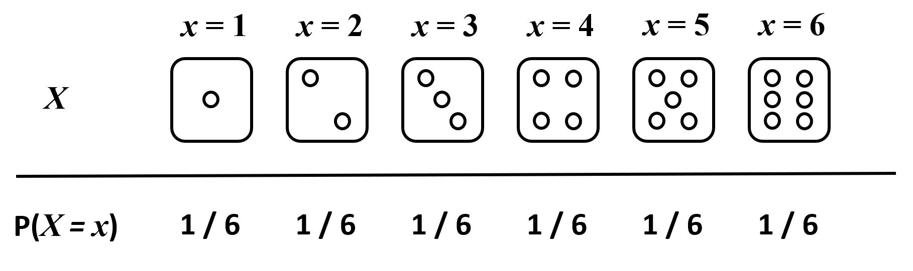
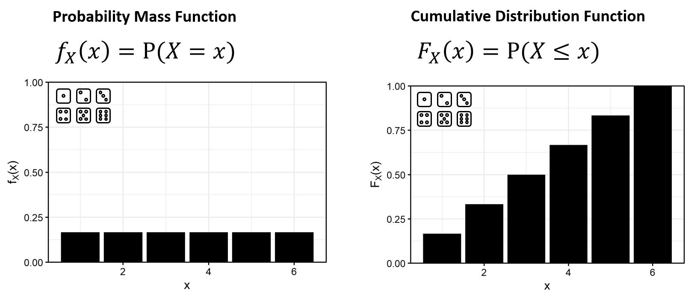
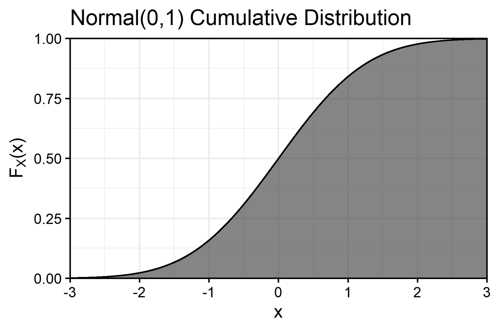
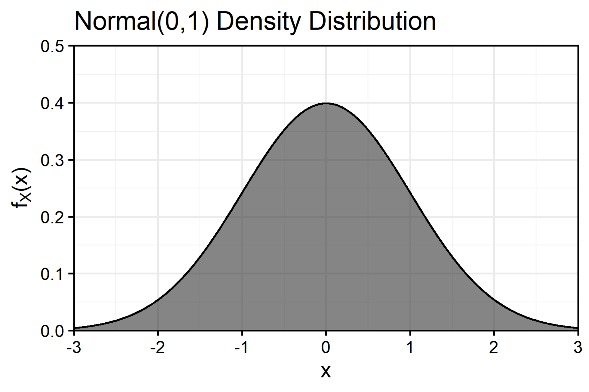

# Introduction

Thus far in this course, we've worked with **deterministic** models: Models for which, given a set of parameters and initial conditions, we obtain exactly the same result at each time step every time we evaluate the model.

In the real world, however, even if we manage to find good approximations for the demographic parameters describing the behavior of a natural population, it's quite unlikely that the population will behave exactly as we expect it to. The real world is more complex and "noisy" than our model - population trajectories depart from our expectations because of random variation in the number and timing of births and deaths (**demographic stochasticity**) and because random variation in the environment creates good years and bad years for growth, survival, and reproduction (**environmental stochasticity**).

Additionally, it's often the case that we have data describing a natural biological phenomenon or population trajectory, and we'd like to use those data to find a good approximation for the parameters of a model that we think describes that system's behavior. Because, again, the real world is noisy, it's rarely the case that we can just "pick" parameters that produce a perfect fit of our model's expectations to the data.

Both of these scenarios necessitate the use of **probabilistic** (or **"stochastic"**) models. To build stochastic population models, or to fit real data to deterministic models, we need to use what are called **probability distributions** - functions which map possible values of a **random variable** to probability (or probability "density").

# Discrete Random Variables

A **random variable** is any value (such as a demographic parameter or the response variable in a statistical model) which is taken to be the outcome of a random process.

Take, for example, the roll of a six-sided die:

In this case, the random variable $X$, representing a roll of the die, has 6 potential outcomes $x \in \{1, 2, 3, 4, 5, 6\}$. Each outcome $x$ corresponds to a probability $P(X = x)$ that our die roll $X$ equals that outcome, which (if we assume the die to be 'fair") is $P(X = x) = 1/6 \approx 0.167$ for $x \in \{1, 2, 3, 4, 5, 6\}$.

Because $X$ has a countable number of potential outcomes, we call it a **discrete** random variable, as distinguished from **continuous** random variables that can taken on any real number (or any real number within an interval), described below.

## Probability Mass Functions

The probability distribution of a discrete random variable is described by a **probability mass function** $f_X(x)$- this is a function which maps an outcome $x$ to a Probability value $P(X = x)$. The PMF for our six-sided die is very simple:

$$
f_X(x) = P(X = x) = 1/6 \; ; \; x \in \{ 1, 2, \ldots, 6\}
$$

This distribution is also called a **discrete uniform** distribution (in this case, for the interval [1,6], but other intervals are possible of course). Other common discrete probability distributions used in ecology are the **Bernoulli**, **Binomial**, **Poisson**, **Negative Binomial**, and **Multinomial** distributions.

## Cumulative Distribution Functions

The **cumulative distribution function** $F_X(x)$ specifies the probability that the given outcome $x$ of the random variable $X$ will be *less than or equal to* $x$. For a six-sized die, the CDF is also very simple:

$$
F_X(x) = P(X \leq x) = \sum_1^x 1/6 \; ; \; x \in \{ 1, 2, \ldots, 6\}
$$

Here is the PMF and CDF for our six-sided die plotted side by side:

# Continuous Random Variables

**Continuous** random variables are conceptually a little harder than discrete random variables - they do not have a countable number of outcomes - meaning they have *infinitely many* outcome values, and that makes the probability of any one outcome $P(X = x) \approx 0$.

This means that the PMF for a continuous random variable, if we wrote one, would always yield 0, which isn't very useful. However, we can still represent continuous random variables using the CDF! For example, even though we might never register a temperature of exactly $60.\bar{00}^\circ$ on our thermometer, if the median daily temperature where I am is $60^\circ$, than the probability that the temperature on any given day is less than or equal to 60 is roughly 0.5.

Thus, we usually define continuous probability distributions by first describing the CDF. Shown below, for example, is the CDF for the standard normal distribution (a normal distribution with a mean of 0 and a standard deviation of 1):

{width="3.75in"}

Thus, for the standard normal distribution, we can see that the probability we obtain a value $x$ which is less than or equal to 0 is $F_X(x) = P(X \leq 0) = 0.5$, the probability we obtain a value less than 1 is $F_X(x) = P(X \leq 0) \approx 0.84$, and so on.

## Probability Density Functions

When most people picture the normal distribution, however, they picture a "bell curve" - this is, in fact, the **probability density function** (also denoted $f_X(x)$, as for the PMF) of the normal distribution, and it's obtained by taking the derivative of the CDF with respect to $x$:

{width="3.75in"}

The PDF is **not** a PMF - it does not return the probability of an outcome $x$, it returns the rate of change of the CDF at $x$ - but luckily, there are many applications for which we can use it as if it were a PMF and not have to worry about the distinction. And, we can read it as we'd expect to read a PMF - we can tell from the density function that values around 0 are more likely than values around 2, for example.

Common continuous probability distributions used in ecology are the **Normal** (or "Gaussian"), **Lognormal**, **Gamma**, **Beta**, **Exponential**, and **Uniform** distributions.

# Lab Exercise

Open `distributions-lab.Rproj` to start a new RStudio session, and open `app.R` within that session. In the upper right-hand corner of the RStudio source viewer, click "Run App," which should launch an interactive dashboard app in a new window. We'll use this app for today's lab.
